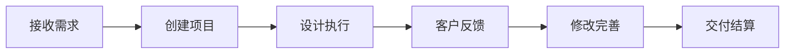

## 内容创作者

### 案例：博客作者小王

**使用场景：** 管理博客创作流程

**解决方案：**

1. **灵感收集** - 随时记录写作灵感
2. **内容规划** - 制定每月创作计划
3. **写作管理** - 跟踪文章进度
4. **发布统计** - 分析文章数据

**效果：**
- ✅ 创作效率提升 50%
- ✅ 发布频率更稳定
- ✅ 内容质量显著提高

<Callout type="success">
"独立工作者帮我建立了系统的创作流程" - 小王
</Callout>

---

## 自由职业者

### 案例：设计师小李

**使用场景：** 管理多个客户项目

**解决方案：**

<Cards>
<Card title="项目管理">
为每个客户创建独立项目
</Card>

<Card title="时间追踪">
记录每个项目的工作时间
</Card>

<Card title="文件整理">
集中管理设计稿和素材
</Card>

<Card title="客户沟通">
记录沟通历史和反馈
</Card>
</Cards>

**工作流程：**

---

## 创业团队

### 案例：小型工作室

**使用场景：** 5人团队协作

**解决方案：**

### 团队协作

| 角色 | 使用方式 |
|------|---------|
| 项目经理 | 任务分配和进度跟踪 |
| 设计师 | 作品展示和版本管理 |
| 开发者 | 技术文档和知识库 |
| 运营 | 内容规划和数据分析 |
| 行政 | 会议记录和行政管理 |

### 协作工具

- 💬 **内部讨论** - 项目评论区
- 📋 **任务看板** - 可视化进度
- 🔔 **实时通知** - 重要更新提醒
- 📊 **数据看板** - 团队绩效

---

## 个人成长

### 案例：职场新人小张

**使用场景：** 学习和成长记录

**学习体系：**

<Steps>
### 设定目标

明确学习目标和时间规划

### 记录笔记

整理学习笔记和心得

### 实践项目

创建练习项目巩固知识

### 复盘总结

定期回顾和反思
</Steps>

**成长记录：**

- 📚 学习笔记 100+ 篇
- 💡 技能提升记录
- 🎯 年度目标追踪
- 📈 能力成长曲线

---

## 生活管理

### 案例：宝妈小刘

**使用场景：** 平衡工作与生活

**管理内容：**

1. **家庭计划**
   - 育儿记录
   - 家庭开支
   - 健康管理

2. **个人发展**
   - 学习计划
   - 兴趣爱好
   - 健身打卡

3. **生活记录**
   - 日记
   - 照片
   - 重要时刻

---

## 更多案例

想分享您的使用案例？[联系我们](#)

还想了解更多？查看[常见问题](/docs/faq)
