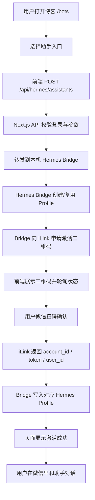
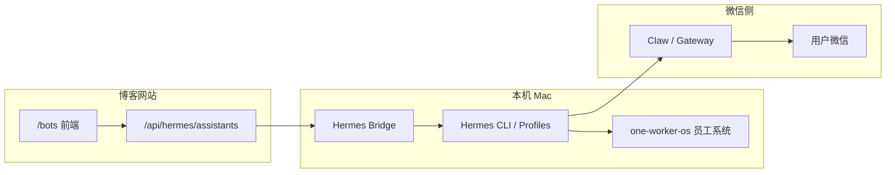

# 微信 AI 助手接入流程

本文档先固定「博客前端如何打通 Hermes」的链路。后台具体开放哪些数字员工、哪些 skill，后续再定。

## 1. MVP 总流程



## 2. 系统边界



博客网站只做产品入口和控制台，不直接执行 shell 命令。真正调用 Hermes 的动作必须收口在 Hermes Bridge。

重要边界：Hermes 原生 `qr_login` 是终端交互流程，会打印二维码并等待确认。博客产品需要把这段流程拆成网页 activation session：Bridge 先返回二维码，前端轮询状态，扫码确认后 Bridge 再把 iLink 返回的凭据写入对应 Hermes Profile。

## 3. 当前先实现的两步

### Step 1：前端

- `/bots` 页面展示助手入口。
- 用户点击「连接 Hermes」。
- 前端提交当前选择到 `/api/hermes/assistants`。
- 前端根据返回结果展示：
  - 创建中
  - Hermes Bridge 未连接
  - 微信激活二维码
  - 激活成功
  - 失败原因

### Step 2：前端打通 Hermes

- Next.js API 作为安全代理。
- API 使用 `HERMES_BRIDGE_URL` 调用本机 Hermes Bridge。
- API 使用 `HERMES_BRIDGE_TOKEN` 做服务端到服务端鉴权。
- Bridge 返回二维码、过期时间和 activation id。

### Step 3：微信用户绑定

- 前端轮询 `/api/hermes/activations/{assistantId}`。
- Next.js API 转发到 Bridge 的 `/activations/status?assistantId=...`。
- 用户用微信扫码并确认。
- Bridge 轮询 iLink QR 状态。
- iLink 返回 `account_id`、`bot_token`、`ilink_user_id`。
- Bridge 写入对应 profile 的 `.env` 和 `weixin/accounts/{account_id}.json`。

## 4. Next.js API 契约

### 前端请求

`POST /api/hermes/assistants`

```json
{
  "roleId": "general",
  "source": "bots-page",
  "locale": "zh"
}
```

### 前端收到的成功响应

```json
{
  "success": true,
  "assistantId": "asst_xxx",
  "activationId": "asst_xxx",
  "status": "qr_ready",
  "connectionMode": "qr_activation",
  "profileName": "assistant_xxx",
  "qrPayload": "https://ilinkai.weixin.qq.com/...",
  "qrImageUrl": null,
  "expiresAt": "2026-05-30T06:00:00.000Z",
  "bindingInstructions": [
    "请用微信扫描二维码并确认。",
    "确认后页面会自动变为激活成功。",
    "激活成功后，这个微信身份会写入对应 Hermes Profile。"
  ],
  "message": "Hermes Profile 已创建；请扫码激活微信助手。"
}
```

### 常见失败响应

```json
{
  "success": false,
  "code": "BRIDGE_UNAVAILABLE",
  "error": "Hermes Bridge 未连接"
}
```

## 5. Hermes Bridge 契约

博客 API 调用：

`POST {HERMES_BRIDGE_URL}/assistants/provision`

请求：

```json
{
  "assistantId": "asst_xxx",
  "userId": "user_xxx",
  "roleId": "general",
  "source": "bots-page",
  "locale": "zh"
}
```

响应：

```json
{
  "success": true,
  "assistantId": "asst_xxx",
  "status": "qr_ready",
  "profileName": "assistant_xxx",
  "connectionMode": "qr_activation",
  "qrPayload": "https://ilinkai.weixin.qq.com/...",
  "qrImageUrl": null,
  "expiresAt": "2026-05-30T06:00:00.000Z",
  "message": "请扫码激活微信助手"
}
```

激活状态：

`GET {HERMES_BRIDGE_URL}/activations/status?assistantId=asst_xxx`

响应：

```json
{
  "success": true,
  "assistantId": "asst_xxx",
  "status": "activated",
  "profileName": "assistant_xxx",
  "weixinAccountId": "xxx@im.bot",
  "weixinUserId": "xxx@im.wechat",
  "message": "微信助手已激活"
}
```

## 6. 后续再接的内容

- assistant 数据表和任务表
- 用户套餐与用量限制
- profile 模板和 one-worker-os 员工组合
- 微信激活后的 connected 状态回传
- 消息、Token、工具调用、产物、成本统计

## 7. 本地启动方式

博客开发服务器：

```bash
pnpm dev
```

Hermes Bridge：

```bash
pnpm hermes:bridge
```

当前 Bridge 已实现：

- `GET /health`
- `POST /assistants/provision`
- `GET /activations/status`
- `POST /pairing/approve`
- dry-run 模式返回演示接入码
- 非 dry-run 模式调用 Hermes CLI 创建/复用 profile
- 向 iLink 申请微信激活二维码
- 轮询 iLink 二维码状态
- 扫码确认后写入 profile 微信凭据

当前 Bridge 暂未实现：

- 微信激活后的 connected 状态回传
- 激活成功后自动启动对应 profile 的 Gateway
- 每个用户到每个 profile 的真实消息路由
