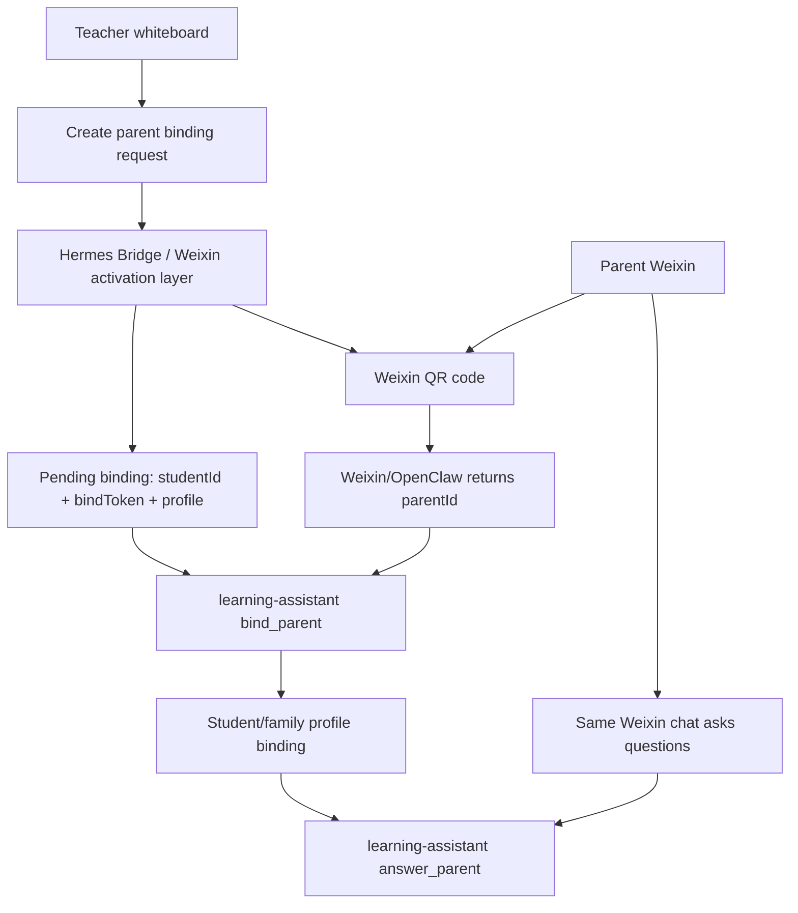

# Hermes Profile Delivery Playbook

## Core Thesis

The reusable product primitive is not "AI". It is a repeatable delivery unit:

```text
capability wrapper x familiar channel x isolated profile x measurable usage
```

`hermes profile` is the implementation primitive behind that unit. A profile is
simultaneously:

- an isolation boundary: independent config, model, memory, skills, and Weixin
- a multi-tenant unit: one child, parent, customer, employee, or assistant
- a cloneable distribution unit: template, clone, provision, activate, operate

The thing being sold is not raw model access. The product is "we package the
system, connect the familiar channel, keep data isolated, and operate it for a
specific person".

## Three Altitudes

| Altitude | Question | Product Answer | Implementation Primitive |
| --- | --- | --- | --- |
| Implementation | How do we isolate and multiply assistants? | One profile per user/object | `hermes profile` |
| Productization | How do we make it sellable? | permissions, accounting, persona, support | provision + usage + billing |
| Platformization | What happens at scale? | infrastructure itself becomes product | bridge, routing, monitoring |

The same master pattern can be reused across education, companion agents,
content operations, image generation, coding assistants, and One Worker OS.

## Correct Binding Model

The final binding flow should not be a web page that asks parents to copy a
token. That is only an MVP fallback.

The target flow is:

```text
whiteboard creates binding request
-> Hermes creates pending binding: studentId + bindToken + target profile/route
-> bridge returns a Weixin-scannable QR code
-> parent scans QR code
-> Weixin/OpenClaw/Hermes obtains parentId from the same chat channel
-> Hermes runs bind_parent(parentId, bindToken)
-> parent asks questions in that same Weixin chat
```

The key invariant:

```text
the identity captured during QR binding must be the same identity used for
future parent chat
```

If a WeChat Official Account QR code is used, the callback identity is an
Official Account `openid`. If later chat happens in an OpenClaw/Hermes personal
Weixin bot, that bot may see a different ID such as `...@im.wechat`. Those two
identities are not automatically the same. Avoid this split unless there is a
clear identity mapping layer.

## Learning Assistant Mapping

For the learning assistant, the purpose axis is education:

```text
profile unit: one student or one family-facing assistant route
channel: Weixin parent chat
capability wrapper: whiteboard quizzes, wrongbook, mastery, parent Q&A
measurable usage: student records, questions answered, tokens, reports
```

Recommended target architecture:



The whiteboard remains thin:

- renders educational shapes/components
- creates binding requests
- records quiz results
- does not own parent identity
- does not maintain a second student database

Hermes remains the brain:

- owns profiles and data
- owns binding state
- owns wrongbook/mastery/parent answers
- owns profile cloning and Weixin activation

## Implementation Stages

### Stage 1: Keep the Current Cloud Hermes Bridge

Current state:

- Zeabur whiteboard calls cloud Hermes for learning-assistant commands.
- Tencent Cloud Hermes owns `learning-assistant` data.
- The current QR page is an MVP fallback that carries `studentId + token`.

Keep this as a fallback, but do not treat it as the final product flow.

### Stage 2: Add a Real Weixin Activation Layer

Find or implement the bridge capability that can:

- create a pending Weixin activation/binding session
- return a QR code that Weixin can scan
- detect scan/approval
- expose the resulting `parentId`
- attach that `parentId` to the intended Hermes profile/route

This is the missing piece between "QR generated" and "parent identity known".

### Stage 3: Replace the Whiteboard QR Payload

Change whiteboard binding generation from:

```text
/parent-bind?studentId=...&token=...
```

to:

```text
Hermes/Bridge activation QR
```

The QR should no longer send parents to a manual-copy page in the normal path.

### Stage 4: Bind and Answer in One Channel

Once scan produces `parentId`, call:

```text
bind_parent(parentId, bindToken)
```

After that, parent Q&A must use the same `parentId` and route/profile:

```text
answer_parent(parentId, question)
```

## One Worker OS Mapping

The same pattern applies to One Worker OS:

```text
profile unit: one employee, one customer, or one customer-facing worker group
channel: Weixin / web / Feishu
capability wrapper: execute, reflect, upgrade, report
measurable usage: tasks, tool calls, costs, deliverables, reports
```

This turns One Worker OS into an employee factory:

```text
template profile -> clone -> configure skills -> activate channel -> operate
```

## Decision Rule

When designing a new product line, ask:

1. What is the profile unit?
2. What familiar channel does the user already trust?
3. What capabilities are wrapped behind that channel?
4. What data/usage proves value and supports billing?
5. Does binding capture the same identity that future chat will use?

If question 5 is not true, the flow will eventually split into two identities
and the product will feel broken.
